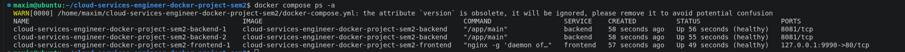
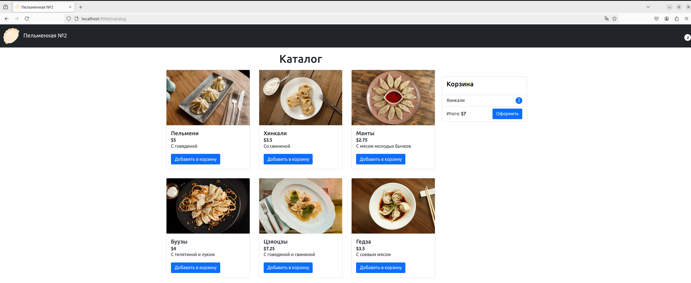
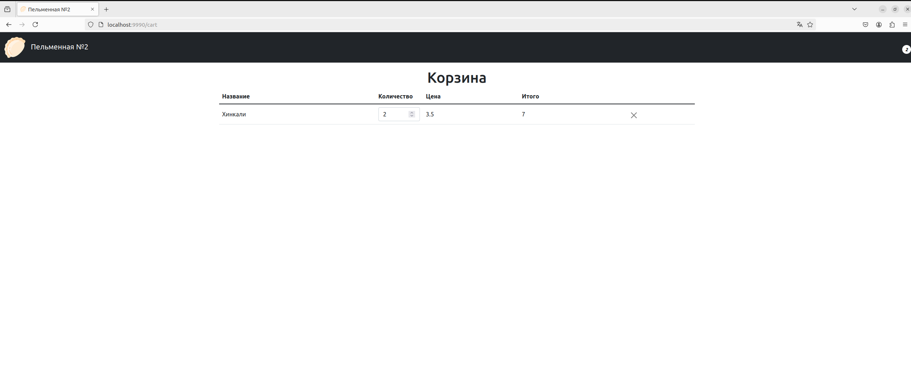

# Проект по дисциплине Docker Порфирьев Максим

В данном проекте релизована сборка легковесных безопасных образов бэкенда и фронта.
Собраны `docker-compose` файлы для разных окружений.
Учтены лучшие практики по настройке безопасности.
---

## Backend

Бинарник на `go` собран и пердан в `alpine`.

Что сделано:
 - Запуск `main` от `non-root` юзера
 - `multi-stage build`
 - healthcheck настроены
 - :8081 порт

Итоговый вес образа составил - `34.1MB`, где content size `11.2MB`.

## Frontend

Статика собирается и передается в `alpine-nginx`.

Что сделано:
 - Запуск `nginx` от `non-root` юзера
 - `multi-stage build`
 - healthcheck настроены
 - :80 порт
 - `nginx.conf` с образе
 - Выданы права тольно на то, что касается `nginx`

Итоговый вес образа составил - `94.2MB`, где content size `26.2MB`.

## Docker compose

Созданы файлы для `dev` и `prod` окружения. Запускаются 2 сервиса - фронт(`nginx`) и бэк(`golang`).

Что сделано:
- Настроены healthchek's
- Образы пулятся с `dockerhub`
- Логин передается через переменные окружения через `.env`
- Отключены все специальные привелегии внутри контейнеров
- Бэк находится в сетке `app`, к нему не достучаться извне
- Подключен `volume` к фолдеру `var/log/nginx`
- Настроены ограничения ресурсов:
    - backend: 5% мощности ядра, 50MB RAM
    - frontend: 5% мощности ядра, 25MB RAM
- Настроена репликация для backend
- Username для докерхаба передается через перменные окружения

> [!TIP]
> Так же представлены 2 вида docker compose файлов - запускаются через `docker compose -f <docker-compose file> up/down`

## Скриншоты

Данный скриншот иллюстрирует, что сервисы работают и они здоровы

Главная страница

Корзина
